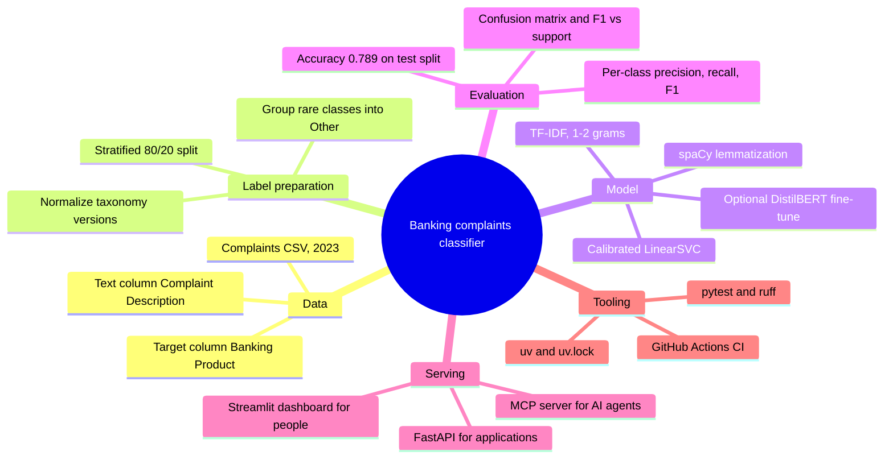
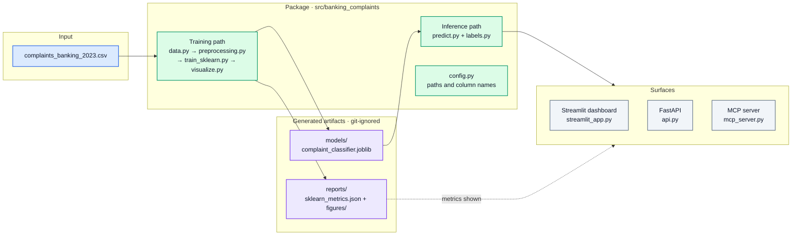

# Banking Complaints Classifier


Route consumer banking complaints to the right product team from the complaint text alone.

Given a free-text narrative, the classifier returns a product category such as
`Bank account issue`, `Credit card issue`, `Credit report issue`, or `Mortgage issue`, plus a
VADER sentiment label. The project started as an exploration notebook and was rebuilt as a
reproducible Python package with a training CLI, tests, a FastAPI endpoint, an MCP server for AI
agents, and a Streamlit dashboard.

**Contents:**
[How it works](#how-it-works) ·
[Mental map](#mental-map) ·
[Architecture](#architecture) ·
[Model](#model) ·
[Quick start](#quick-start) ·
[Dashboard](#streamlit-dashboard) ·
[API](#api-serving) ·
[MCP](#mcp-server) ·
[Development](#development) ·
[Project layout](#project-layout)

## How it works

One left-to-right pipeline. Each stage hands a single thing to the next: raw rows, clean labels,
a fitted model, saved artifacts, and finally the three surfaces that consume the saved model.

```mermaid
flowchart LR
    classDef data fill:#dbeafe,stroke:#2563eb,stroke-width:1.5px,color:#0f172a
    classDef prep fill:#fef3c7,stroke:#d97706,stroke-width:1.5px,color:#0f172a
    classDef train fill:#dcfce7,stroke:#059669,stroke-width:1.5px,color:#0f172a
    classDef out fill:#ede9fe,stroke:#7c3aed,stroke-width:1.5px,color:#0f172a
    classDef serve fill:#f1f5f9,stroke:#64748b,stroke-width:1.5px,color:#0f172a

    subgraph S1["1 · Data"]
        direction TB
        A["Complaints CSV<br/>complaints_banking_2023.csv"]
        B["Load and validate<br/>drop empty rows, check columns"]
    end

    subgraph S2["2 · Prepare labels"]
        direction TB
        C["Normalize taxonomy<br/>merge renamed products"]
        D["Group rare classes<br/>under 50 rows become Other"]
        E["Stratified split<br/>80% train / 20% test"]
    end

    subgraph S3["3 · Train"]
        direction TB
        F["spaCy lemmatization<br/>en_core_web_sm"]
        G["TF-IDF features<br/>1-2 grams, 50k max"]
        H["Calibrated LinearSVC<br/>class_weight=balanced"]
    end

    subgraph S4["4 · Evaluate and save"]
        direction TB
        I["Metrics report<br/>reports/sklearn_metrics.json"]
        J["Figures<br/>reports/figures/*.png"]
        K["Model artifact<br/>models/complaint_classifier.joblib"]
    end

    subgraph S5["5 · Serve"]
        direction TB
        L["Streamlit dashboard<br/>people"]
        M["FastAPI /predict<br/>applications"]
        N["MCP tools<br/>AI agents"]
    end

    A --> B --> C --> D --> E --> F --> G --> H
    H --> I
    H --> J
    H --> K
    K --> S5

    class A,B data
    class C,D,E prep
    class F,G,H train
    class I,J,K out
    class L,M,N serve
```



Run the whole pipeline with one command:

```bash
uv run python -m banking_complaints.train_sklearn
```

## Mental map

The same project seen as a map instead of a timeline: what goes in, what the model is, how it is
judged, who consumes it, and what keeps it reproducible.



## Architecture

Four columns, read left to right. The dataset feeds the training path, training writes two
artifacts, the inference path loads the model, and the three surfaces only ever talk to the
inference path and the saved report.



| Module | Responsibility |
| --- | --- |
| `config.py` | Project paths and dataset column names |
| `data.py` | Load the CSV, normalize product labels, group rare classes |
| `preprocessing.py` | spaCy lemmatizer transformer for sklearn, VADER sentiment |
| `train_sklearn.py` | Build and fit the pipeline, write metrics, figures, and the model |
| `visualize.py` | Class distribution, confusion matrix, and F1 vs support figures |
| `predict.py` | Load the saved model and return product, sentiment, confidence |
| `labels.py` | Map internal model labels to user-friendly display labels |
| `api.py` | FastAPI app with `/health` and `/predict` |
| `mcp_server.py` | MCP tools for classification, metrics, categories, and examples |
| `train_bert.py` | Optional DistilBERT fine-tuning for comparison |

## Model

```text
Complaint Description
-> spaCy lemmatization
-> TF-IDF vectorization (unigrams + bigrams)
-> calibrated LinearSVC
-> normalized product category + VADER sentiment
```

Held-out test accuracy: **0.7890**.

The model predicts the normalized internal labels used for training. The dashboard and the MCP
tools translate them into friendlier labels.

| Internal model label | Display label |
| --- | --- |
| Bank account / checking / savings | Bank account issue |
| Consumer / vehicle loan | Loan issue |
| Credit card / prepaid card | Credit card issue |
| Credit reporting | Credit report issue |
| Debt collection | Debt collection issue |
| Money transfer / money service | Money transfer issue |
| Mortgage | Mortgage issue |
| Other | Other financial issue |
| Student loan | Student loan issue |

Training writes three local artifacts, all ignored by git:

```text
models/complaint_classifier.joblib
reports/sklearn_metrics.json
reports/figures/
```

## Quick start

Requirements: Python 3.10 to 3.12 and [uv](https://docs.astral.sh/uv/).

```bash
uv sync                                          # create .venv from uv.lock (includes dev tools)
uv run python -m banking_complaints.train_sklearn  # train and save the model
uv run streamlit run streamlit_app.py            # open the dashboard at http://localhost:8501
```

`uv sync` installs the package in editable mode and the spaCy English model, so no separate
`spacy download` step is needed. Prefix commands with `uv run`, or activate the environment once
with `source .venv/bin/activate`.

Optional dependency groups:

```bash
uv sync --group bert   # PyTorch and Transformers for BERT fine-tuning
uv sync --group mcp    # official MCP Python SDK for the MCP server
```

Optional notebook kernel:

```bash
uv run python -m ipykernel install --user --name banking-complaints-nlp --display-name "Python (banking complaints NLP)"
```

## Streamlit Dashboard

The dashboard is the main demo interface. It shows live complaint classification with friendly
labels, session prediction count and response time, saved model accuracy, the model improvement
curve, class-level precision, recall, F1, and support, original versus normalized training labels,
and sampled training-row predictions.

```bash
uv run streamlit run streamlit_app.py
```

## API Serving

```bash
uv run uvicorn banking_complaints.api:app --reload
```

```bash
curl -X POST http://127.0.0.1:8000/predict \
  -H "Content-Type: application/json" \
  -d '{"text": "The bank charged me fees I do not recognize and nobody has resolved my complaint."}'
```

```json
{
  "product": "Bank account / checking / savings",
  "sentiment": "negative",
  "confidence": 0.71
}
```

## MCP Server

The MCP server exposes the classifier as structured tools for AI assistants and agents. FastAPI
remains the normal application API.

| Audience | Surface |
| --- | --- |
| People | Streamlit dashboard |
| Applications | FastAPI |
| AI assistants and agents | MCP server |

Tools:

- `classify_complaint_tool`: classify text with the saved model
- `get_model_metrics_tool`: return saved accuracy and F1 metrics
- `get_supported_categories_tool`: list model categories with friendly labels
- `get_category_examples_tool`: retrieve real training examples for a category

```bash
uv sync --group mcp
uv run python -m banking_complaints.mcp_server
```

Clients connect to `http://localhost:8000/mcp`. The server binds to localhost only. Do not expose
it publicly without adding authentication.

## BERT comparison

An optional DistilBERT fine-tuning path exists for comparison with the default model:

```bash
uv sync --group bert
uv run python -m banking_complaints.train_bert \
  --data-path complaints_banking_2023.csv \
  --model-name distilbert-base-uncased \
  --output-dir models/bert_classifier \
  --report-path reports/bert_metrics.json
```

## Development

```bash
PYTEST_DISABLE_PLUGIN_AUTOLOAD=1 uv run pytest -q
uv run ruff check src tests streamlit_app.py
uv run ruff format --check src tests streamlit_app.py
```

GitHub Actions runs the same three checks with uv on Python 3.11 for every push to `main` and
every pull request.

Reproducibility notes:

- The dataset is a local CSV with redacted narratives. Never commit credentials or unredacted
  personal data.
- Trained models, reports, caches, and the virtual environment are generated and git-ignored.
- BERT dependencies live in the optional `bert` group because PyTorch and Transformers are large
  and not needed for the default model.

## Project layout

```text
src/banking_complaints/      production Python package
tests/                       automated tests
streamlit_app.py             dashboard UI
complaints_banking_2023.csv  local dataset
NLP_Project_Andres_RL.ipynb  original exploration notebook
pyproject.toml               project metadata and dependency groups (dev, bert, mcp)
uv.lock                      pinned dependency lockfile used by uv sync
.streamlit/config.toml       dashboard theme
.github/workflows/ci.yml     GitHub Actions lint and test workflow
models/                      generated model artifacts, git-ignored
reports/                     generated metrics and figures, git-ignored
```

## Notebook role

The notebook is the exploration record: EDA, preprocessing experiments, model trials, and the
original project write-up. The reusable implementation lives in `src/banking_complaints` so it
can be trained, tested, served, and demonstrated outside the notebook. The `dev` group includes
Jupyter plus the notebook-only libraries (`nltk`, `seaborn`); the BERT cells also need the `bert`
group.
