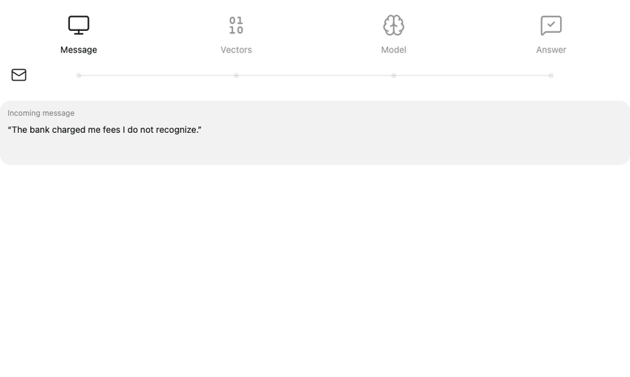

# Banking Complaints Classifier


This project ships two things: a routing model for consumer banking complaints and a demo
showing it at work on an inbox.

The model was trained on 6,900+ real bank complaint comments carrying 17 product labels, merged
into 7 target classes. TF-IDF turns each complaint into numbers, and a logistic regression
classifier learns which words point to which product.

A complaint goes in as free text. The model returns one of seven product classes, a confidence
score, and a destination mailbox. Complaints below a confidence threshold go to a review queue
for a person. The model and serving code live in `src/complaints/`; the two-page Streamlit demo
lives at `frontend/app.py`.

**Contents:**
[How it works](#how-it-works) ·
[Results](#results) ·
[Quick start](#quick-start) ·
[Serving](#serving) ·
[Demo](#demo) ·
[Development](#development) ·
[Project layout](#project-layout)

## How it works

The data path runs once and freezes a train set and a test set. The model path fits one model on
the train rows, scores it on the test rows exactly once, and serves it.


## Results

Baseline model, scored once on the 1,388 complaints it never saw.

| Metric | Value |
| --- | --- |
| Accuracy | 0.825 |
| Macro F1 | 0.806 |
| Routed automatically, threshold 0.75 | 44% of complaints, 95.0% of them correct |

<p>
  
  
</p>

Rows of the confusion matrix are the true class; the diagonal is what the model got right. The
class map shows the same story from the training side: each dot is one complaint, placed near
the complaints that use similar words. Mortgage and Debt collection have their own regions, Bank
account and Credit card share one, and Loan has no region of its own.

Per-class scores, the full confusion matrix, the threshold curve, and the most confident wrong
predictions are in `reports/evaluate/`.

## Quick start

Python 3.10 to 3.12 and [uv](https://docs.astral.sh/uv/). The trained model ships in the repo as
`models/baseline.joblib`, with the frozen test set next to it, so nothing needs training. Run
`uv sync` once, then open whichever door you want. All three load that one file.

| For | Door | Command |
| --- | --- | --- |
| People | Streamlit app | `uv run streamlit run frontend/app.py`, then open http://localhost:8501 |
| Applications | FastAPI `POST /predict` | `uv run uvicorn complaints.api:app --reload`, then see [API](#api) |
| AI agents | MCP tools over stdio | `uv sync --group mcp && uv run python -m complaints.mcp_server` |

To retrain from the raw CSV, run the stages in order: `clean`, `split`, `train`, `evaluate`, each
as `uv run python -m complaints.<stage>`. Each one prints what it wrote. Browse the runs with
`uv run mlflow ui --backend-store-uri sqlite:///mlruns/mlflow.db`.

## Serving

One predictor, three doors. `predictor.py` loads `models/baseline.joblib` once and, for each
complaint, returns the product, the confidence, the class probabilities, a review flag, and a
destination mailbox. Confidence below the threshold in `configs/serving.yaml` sends the complaint
to the review queue instead of a team mailbox. Mailboxes come from `configs/routing.yaml`, one per
class plus the review queue, and are demo values.

### API

Start FastAPI with the command in [Quick start](#quick-start), then call it from another terminal.

| Endpoint | Returns |
| --- | --- |
| `POST /predict` | Product, confidence, review flag, class probabilities, and `destination` mailbox |
| `GET /health` | Model name, threshold, classes, and the routing table |
| `GET /inbox?n=20&seed=42` | A seeded sample of held-out complaints wrapped as emails, `n` from 1 to 200 |
| `GET /inbox/next` | One email per call, cycling through the default sample |

One call, start to finish: the text becomes a TF-IDF vector, the model scores it, and the JSON
below comes back from `POST /predict`. Confidence 0.35 is under the 0.75 threshold, so this one
goes to the review queue.

<picture>
  <source media="(prefers-color-scheme: dark)" srcset="docs/message-to-answer-dark.gif">
  
</picture>

### Limits

Local demo only: no authentication, and no real email is sent. The model reads banking
complaints; unrelated text is not guaranteed to be flagged for review.

## [Demo](docs/demo.md)

A two-page Streamlit app shows the model routing a bank's complaint inbox: one page handles
emails one at a time, the other routes the whole test set and shows it as an inbox. The
walkthrough in `docs/demo.md` has the launch command, screenshots of both pages, and what each
control does.

## Development

```bash
PYTEST_DISABLE_PLUGIN_AUTOLOAD=1 uv run pytest -q
uv run ruff check src tests frontend
uv run ruff format --check src tests frontend
```

GitHub Actions runs the same three checks with uv on Python 3.11 for every push to `main` and
every pull request.

Reproducibility notes:

- The dataset is a local CSV with redacted narratives. Never commit credentials or unredacted
  personal data.
- The split is deterministic, seed 42, and `reports/split/assignment.csv` records which Complaint
  ID went where.
- Trained models, parquet files, MLflow runs, and the virtual environment are git-ignored.
- Optional dependency groups: `mcp` for the MCP SDK, `notebook` for Jupyter and historical
  notebook libraries, and `dev` for tests and linting.

## Project layout

```text
src/complaints/              one module per stage, plus the serving doors
src/complaints/live.py       handles individual demo messages, times predictions, tracks scoreboard
src/complaints/inbox.py      builds fake mail from held-out complaints, batches routing and counts
frontend/app.py              Streamlit Bank email workflow demo and Inbox pages
configs/                     runtime.yaml, labels.yaml, baseline.yaml, serving.yaml, routing.yaml
configs/routing.yaml         one team mailbox per class and the review queue
tests/                       tests for every stage
reports/                     committed outputs of every stage
data/raw/                    complaints_banking_2023.csv, the dataset
data/processed/              parquet files, git-ignored
models/  mlruns/             saved model and MLflow runs, git-ignored
notebooks/                   original exploration notebook
docs/pipeline.svg            the training map above
pyproject.toml               metadata and dependency groups
uv.lock                      pinned lockfile used by uv sync
.github/workflows/ci.yml     lint and test workflow
```

## Notebook role

The notebook is the exploration record: EDA, preprocessing experiments, model trials, and the
original write-up. The reusable implementation lives in `src/complaints`. Opening the notebook needs its own
dependencies: `uv sync --group notebook`.
