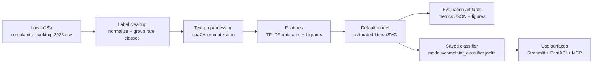
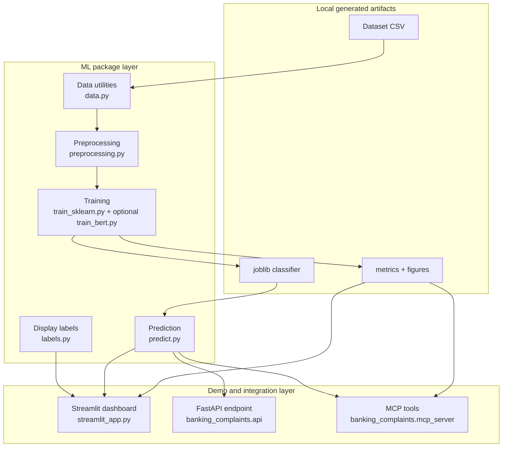

# Banking Complaints Classifier


Classify consumer banking complaint narratives into likely financial product categories.

`banking-complaints-classifier` turns raw complaint text into a routing suggestion such as
`Bank account issue`, `Credit card issue`, `Credit report issue`, or `Mortgage issue`.
The project started in a notebook, then was moved into a reproducible Python package with
training scripts, tests, a prediction API, and a Streamlit dashboard.

[Workflow](#workflow) · [Dashboard](#streamlit-dashboard) · [Train](#model-training) · [API](#api-serving) · [MCP](#mcp-server) · [Notebook](#notebook-role)

## Workflow



## Architecture



## Current Model

The default production model is:

```text
Complaint Description
-> spaCy lemmatization
-> TF-IDF vectorization
-> calibrated LinearSVC classifier
-> normalized product category
```

Current held-out test accuracy:

```text
0.7890
```

The model predicts the normalized internal labels used for training, while the dashboard displays
friendlier labels for users.

| Internal model label | Dashboard label |
| --- | --- |
| Bank account / checking / savings | Bank account issue |
| Consumer / vehicle loan | Loan issue |
| Credit card / prepaid card | Credit card issue |
| Credit reporting | Credit report issue |
| Debt collection | Debt collection issue |
| Money transfer / money service | Money transfer issue |
| Mortgage | Mortgage issue |
| Other | Other financial issue |
| Student loan | Student loan issue |

## Streamlit Dashboard

The Streamlit dashboard is the main demo interface.

It shows:

- live complaint classification
- user-friendly prediction labels
- session prediction count and response time
- saved model accuracy
- model improvement curve
- class-level precision, recall, F1, and support
- original vs normalized training labels
- sampled training-row predictions

Run it with:

```bash
streamlit run streamlit_app.py
```

Then open:

```text
http://localhost:8501
```

## Local Setup

This project uses `uv` for a reproducible local setup. Python 3.11 is the recommended
runtime for the app, tests, and CI.

```bash
uv venv --python 3.11
source .venv/bin/activate
uv pip install -r requirements-dev.txt -e .
```

The spaCy English model is installed through `requirements.txt`, so no separate
`spacy download` command is needed.

Optional notebook kernel:

```bash
python -m ipykernel install --user --name banking-complaints-nlp --display-name "Python (banking complaints NLP)"
```

In VS Code, select the notebook kernel named `Python (banking complaints NLP)` if you want
to run the original notebook locally.

## Model Training

Train the default sklearn model:

```bash
source .venv/bin/activate
python -m banking_complaints.train_sklearn
```

Training writes generated local artifacts:

```text
models/complaint_classifier.joblib
reports/sklearn_metrics.json
reports/figures/
```

These artifacts are ignored by git so the repository stays lightweight.

The project also includes an optional BERT fine-tuning path for comparison:

```bash
python -m pip install -r requirements-bert.txt
```

```bash
python -m banking_complaints.train_bert \
  --data-path complaints_banking_2023.csv \
  --model-name distilbert-base-uncased \
  --output-dir models/bert_classifier \
  --report-path reports/bert_metrics.json
```

## API Serving

Serve predictions with FastAPI:

```bash
uvicorn banking_complaints.api:app --reload
```

Example request:

```bash
curl -X POST http://127.0.0.1:8000/predict \
  -H "Content-Type: application/json" \
  -d '{"text": "The bank charged me fees I do not recognize and nobody has resolved my complaint."}'
```

Example response:

```json
{
  "product": "Bank account / checking / savings",
  "sentiment": "negative"
}
```

## MCP Server

The MCP server is for AI assistants and agents. It exposes the classifier as structured tools,
while FastAPI remains the normal application API.

```text
Human demo -> Streamlit
Application integration -> FastAPI
AI assistant / agent -> MCP
```

The first MCP tools are:

- `classify_complaint_tool`: classify text with the saved model
- `get_model_metrics_tool`: return saved accuracy and F1 metrics
- `get_supported_categories_tool`: list model categories with user-friendly labels
- `get_category_examples_tool`: retrieve real training examples for a category

The official MCP Python SDK requires Python 3.10 or newer. Install the optional MCP environment:

```bash
python -m pip install -r requirements-mcp.txt
```

Run the server:

```bash
python -m banking_complaints.mcp_server
```

MCP clients can connect to:

```text
http://localhost:8000/mcp
```

## Tests

Run the automated tests:

```bash
PYTEST_DISABLE_PLUGIN_AUTOLOAD=1 uv run pytest -q
```

Run lint checks:

```bash
uv run ruff check src tests streamlit_app.py
uv run ruff format --check src tests streamlit_app.py
```

CI runs the same checks with `uv` on Python 3.11.

## Security and Reproducibility

- The dataset is a local CSV with redacted complaint narratives; do not commit raw secrets,
  credentials, or unredacted personal data.
- Trained models, reports, NLTK downloads, caches, and local virtual environments are generated
  artifacts and are ignored by git.
- BERT dependencies are intentionally optional in `requirements-bert.txt` because PyTorch and
  Transformers are large and not needed for the default demo model.
- The MCP server binds to localhost for local agent integration; do not expose it publicly without
  adding authentication and deployment hardening.

## Project Layout

```text
src/banking_complaints/      production Python package
tests/                       automated tests
models/                      generated trained model artifacts, ignored by git
reports/                     generated evaluation metrics and figures, ignored by git
nltk_data/                   local NLTK assets, ignored by git
streamlit_app.py             dashboard UI
NLP_Project_Andres_RL.ipynb  original exploration notebook
complaints_banking_2023.csv  local dataset
requirements-ci.txt          CI lint/test dependencies
requirements-mcp.txt         optional MCP server dependencies
requirements-bert.txt        optional BERT fine-tuning dependencies
.github/workflows/ci.yml     GitHub Actions lint/test workflow
```

## Notebook Role

The notebook is the exploration record: initial EDA, preprocessing experiments, model trials,
and project explanation. The reusable implementation now lives in `src/banking_complaints`
so it can be trained, tested, served, and demonstrated outside the notebook.
