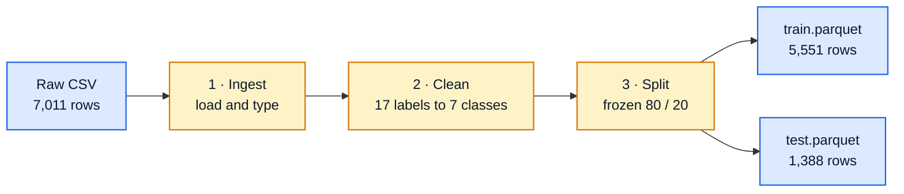
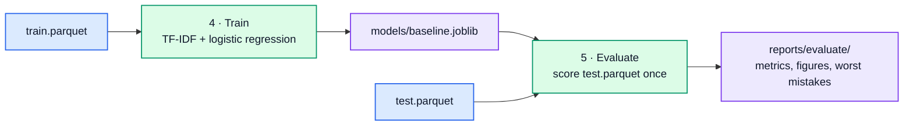
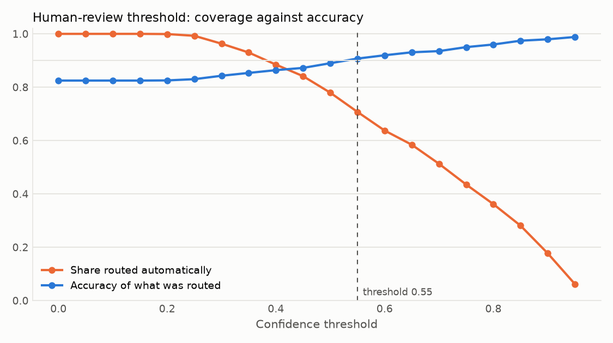
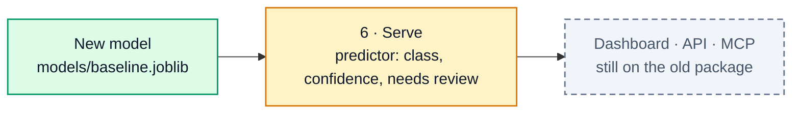

# Banking Complaints Classifier


Route consumer banking complaints to the right product team from the complaint text alone.

Given a free-text narrative, the model returns one of seven product classes and a confidence
score. Complaints below a confidence threshold are handed to a person instead of routed
automatically. The project began as an exploration notebook, became a Python package, and has now
been rebuilt from the ground up as small, separately runnable stages under `project-rebuild/`.

**Status:** the new model is trained and evaluated. The dashboard, API, and MCP server still run
on the old package until the serve stage lands. See [Migration](#migration).

**Contents:**
[How it works](#how-it-works) ·
[Results](#results) ·
[Old model vs new model](#old-model-vs-new-model) ·
[Stages and files](#stages-and-files) ·
[Quick start](#quick-start) ·
[Migration](#migration) ·
[Serving today](#serving-today) ·
[Development](#development) ·
[Project layout](#project-layout)

## How it works

Two paths. The data path runs once and freezes a train set and a test set. The model path reads
the train set, fits one model, and scores it on the test set exactly once.

**Data path, runs once**



**Model path, the one model that ships**



Every training run is logged to a local MLflow folder with its config and scores, so a second
model can be trained on the same rows and compared in one table.

A few decisions worth knowing:

- **The test set is read once.** Split is a stage of its own, and the Complaint ID to train or test
  assignment is written to disk. Every model is scored on identical rows.
- **Cleaning is not modelling.** The clean stage collapses anonymised tokens and money masks, drops
  very short and duplicate complaints, and maps labels. Lowercasing, stop words, and lemmatisation
  are model choices and live in the model config.
- **Labels come from a YAML file.** The source CSV mixes two taxonomy versions. `labels.yaml` maps
  17 raw labels onto 7 classes and fails loudly if a raw label is missing.
- **Logistic regression gives real probabilities.** That is what the human-review threshold needs.

## Results

Baseline model, scored once on the 1,388 complaints it never saw.

| Metric | Value | Note |
| --- | --- | --- |
| Accuracy | 0.825 | Old model on its own split: 0.789 |
| Macro F1 | 0.806 | Every class counts the same, big or small |
| Human-review threshold | 0.55 | Routes 71% of complaints automatically at 90.7% accuracy |
| Weakest class | Loan, F1 0.68 | 32 test rows, spills into four other classes |

| Class | Precision | Recall | F1 | Test rows |
| --- | --- | --- | --- | --- |
| Bank account | 0.86 | 0.90 | 0.88 | 463 |
| Credit card | 0.79 | 0.78 | 0.79 | 320 |
| Credit reporting | 0.77 | 0.75 | 0.76 | 216 |
| Mortgage | 0.88 | 0.91 | 0.89 | 169 |
| Debt collection | 0.77 | 0.74 | 0.75 | 148 |
| Student loan | 0.97 | 0.83 | 0.89 | 40 |
| Loan | 0.74 | 0.63 | 0.68 | 32 |

<p>
  
  
</p>

Rows of the confusion matrix are the true class. The two biggest leaks are credit card read as
bank account, and credit reporting read as credit card. The threshold curve shows the trade: raise
the cutoff and fewer complaints route automatically, but the ones that do are right more often.

The full numbers are in `project-rebuild/reports/evaluate/baseline.json`, and the most confident
wrong predictions are in `worst_mistakes.csv` next to it.

## Old model vs new model

| Step | Old | New | Why |
| --- | --- | --- | --- |
| Data cleaning | Drop empty rows only | Redaction and money masks collapsed, short texts and duplicates removed | 13 anonymised tokens per complaint were feeding the vocabulary as noise |
| Labels | Mapped in Python, rare classes into Other | 7 classes from `labels.yaml`, no Other bucket | Other had 9 test rows and half recall. Money transfer merged into bank account on evidence |
| Train / test split | Re-split inside every training run | Frozen once to parquet, assignment on record | Models can only be compared on identical rows |
| Text conversion | spaCy lemmatisation, then TF-IDF | TF-IDF only | Lemmatisation was most of the prediction cost for no measurable gain |
| Classifier | LinearSVC inside a calibration wrapper | Logistic regression | Gives real probabilities on its own, which the human-review threshold needs |
| Packaging | scikit-learn Pipeline saved with joblib | Same | Nothing better exists for this job |
| Second output | VADER sentiment | None for now | Nearly every complaint scores negative, so sentiment carries no information |
| Experiment tracking | One JSON file, overwritten each run | MLflow, one row per run | Baseline vs later experiments is the result the project shows |

## Stages and files

Each stage is one module under `project-rebuild/complaints/`, runnable on its own, with a
`--config` flag that points at `configs/runtime.yaml`. Command-line paths override the YAML.

| Stage | Module | Reads | Writes |
| --- | --- | --- | --- |
| 1 · Ingest | `ingest.py` | `complaints_banking_2023.csv` | Nothing. Library used by the next two stages |
| 1 · Data study | `data_study.py` | Raw CSV | `reports/data_study/audit.json`, `study.md` |
| 2 · Clean | `clean.py` | Raw CSV, `configs/labels.yaml` | `data/processed/clean.parquet`, `reports/cleaning/report.json` |
| 3 · Split | `split.py` | `clean.parquet` | `train.parquet`, `test.parquet`, `reports/split/` |
| 4 · Train | `train.py` | `train.parquet`, `configs/baseline.yaml` | `models/baseline.joblib`, `reports/train/baseline.json`, MLflow run |
| 5 · Evaluate | `evaluate.py` | `test.parquet`, `models/baseline.joblib` | `reports/evaluate/baseline.json`, `worst_mistakes.csv`, `figures/` |

Two more modules support the stages. `config.py` resolves paths and loads the label map, and
`vectorize.py` builds the TF-IDF step from `configs/baseline.yaml`.

Configuration lives in three YAML files under `project-rebuild/configs/`:

| File | Holds |
| --- | --- |
| `runtime.yaml` | Every input and output path, relative to `project-rebuild` |
| `labels.yaml` | The 17 raw labels to 7 classes map, the drop list, and the minimum word count |
| `baseline.yaml` | Every modelling choice: n-grams, vocabulary size, regularisation, class weights |

## Quick start

Requirements: Python 3.10 to 3.12 and [uv](https://docs.astral.sh/uv/).

```bash
uv sync                               # create .venv from uv.lock
cd project-rebuild
uv run python -m complaints.data_study   # audit the raw CSV, optional
uv run python -m complaints.clean        # labels and text cleaning
uv run python -m complaints.split        # freeze train and test
uv run python -m complaints.train        # fit the baseline, log to MLflow
uv run python -m complaints.evaluate     # score the test set once
```

Every stage prints what it wrote. Reports are committed so the numbers above can be checked
without retraining. Parquet files, the saved model, and the MLflow folder are git-ignored and
regenerate in under a minute. Add `--no-learning-curve` to evaluate to skip its slowest figure.

To browse the runs:

```bash
cd project-rebuild && uv run mlflow ui --backend-store-uri sqlite:///mlruns/mlflow.db
```

## Migration

The rebuild replaces the old package `src/banking_complaints` one piece at a time. The training
side is done. The serving side is next.



| Step | State |
| --- | --- |
| Stages 1 to 5: ingest, clean, split, train, evaluate | Done, 39 tests |
| Stage 6: a predictor that loads the model once and returns class, confidence, and a needs-review flag | Next |
| Point FastAPI, Streamlit, and the MCP server at the predictor | After stage 6 |
| Remove `src/banking_complaints` and the old `models/` and `reports/` folders | Last |
| Optional experiments: sentence embeddings, DistilBERT, scored with the same evaluate stage | After migration |

The baseline ships unless an experiment beats it clearly on the same test rows.

## Serving today

Until the migration reaches them, these three surfaces load the old model at
`models/complaint_classifier.joblib` and use its nine labels and sentiment output. Train that
model first with `uv run python -m banking_complaints.train_sklearn`.

| Audience | Surface | Command |
| --- | --- | --- |
| People | Streamlit dashboard | `uv run streamlit run streamlit_app.py` |
| Applications | FastAPI `/predict` | `uv run uvicorn banking_complaints.api:app --reload` |
| AI assistants and agents | MCP server | `uv sync --group mcp && uv run python -m banking_complaints.mcp_server` |

```bash
curl -X POST http://127.0.0.1:8000/predict \
  -H "Content-Type: application/json" \
  -d '{"text": "The bank charged me fees I do not recognize and nobody has resolved my complaint."}'
```

The MCP server binds to localhost only. Do not expose it publicly without adding authentication.

## Development

```bash
PYTEST_DISABLE_PLUGIN_AUTOLOAD=1 uv run pytest -q          # old package tests and rebuild tests
uv run ruff check src tests project-rebuild streamlit_app.py
uv run ruff format --check src tests project-rebuild streamlit_app.py
```

GitHub Actions runs the same three checks with uv on Python 3.11 for every push to `main` and
every pull request.

Reproducibility notes:

- The dataset is a local CSV with redacted narratives. Never commit credentials or unredacted
  personal data.
- The split is deterministic, seed 42, and `reports/split/assignment.csv` records which Complaint
  ID went where.
- Trained models, parquet files, MLflow runs, and the virtual environment are git-ignored.
- Optional dependency groups: `bert` for PyTorch and Transformers, `mcp` for the MCP SDK, `dev`
  for Jupyter and the notebook-only libraries.

## Project layout

```text
project-rebuild/
  complaints/                new package, one module per stage
  configs/                   runtime.yaml, labels.yaml, baseline.yaml
  reports/                   committed outputs of every stage
  tests/                     tests for the rebuild
  data/processed/            parquet files, git-ignored
  models/  mlruns/           saved model and MLflow runs, git-ignored
src/banking_complaints/      old package, still serves the dashboard, API, and MCP
tests/                       old package tests
streamlit_app.py             dashboard UI, old model
complaints_banking_2023.csv  local dataset
NLP_Project_Andres_RL.ipynb  original exploration notebook
pyproject.toml               metadata, both packages, dependency groups
uv.lock                      pinned lockfile used by uv sync
.github/workflows/ci.yml     lint and test workflow
```

## Notebook role

The notebook is the exploration record: EDA, preprocessing experiments, model trials, and the
original write-up. The reusable implementation now lives in `project-rebuild/complaints`.
