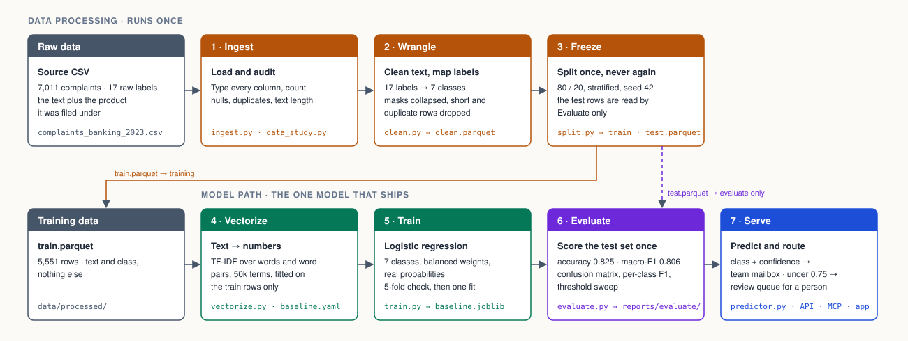
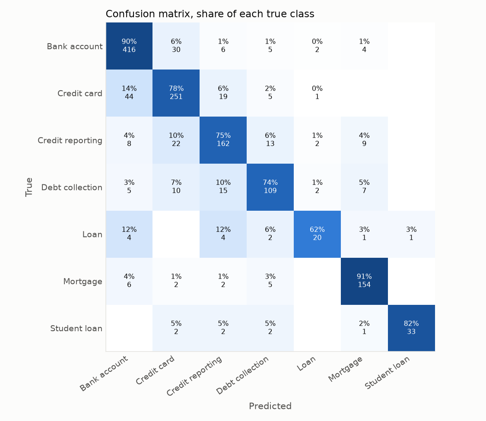
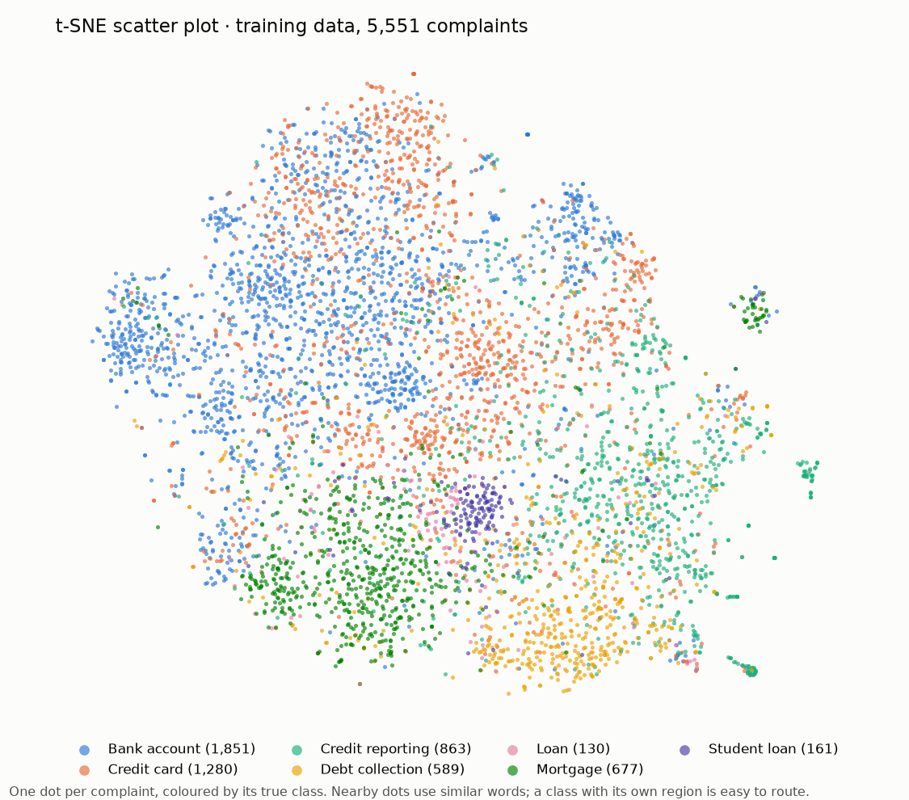
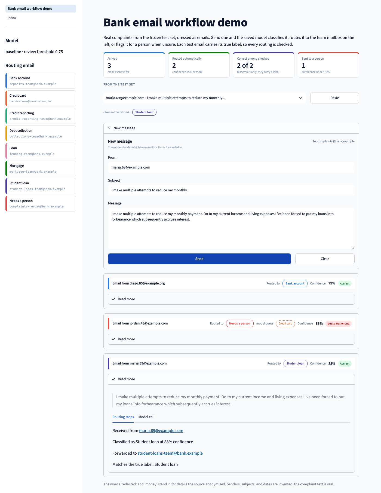
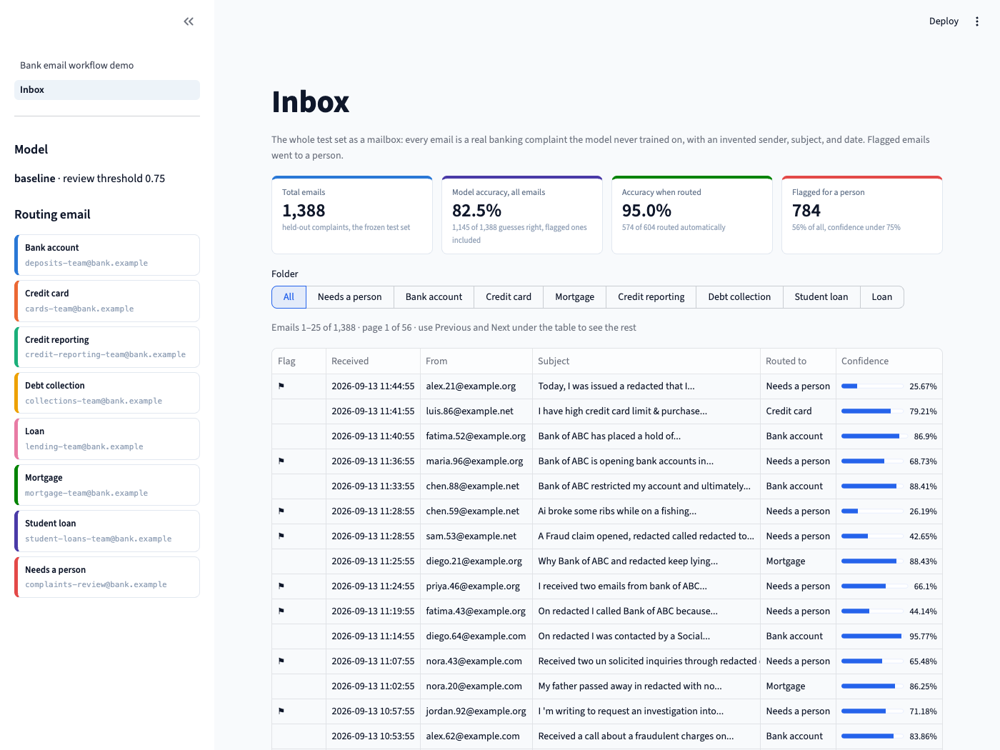

# Banking Complaints Classifier


This project ships two things: a routing model for consumer banking complaints and a demo
showing it at work on an inbox.

The model was trained on 6,900+ real bank complaint comments carrying 17 product labels, merged
into 7 target classes. TF-IDF turns each complaint into numbers, and a logistic regression
classifier learns which words point to which product.

A complaint goes in as free text. The model returns one of seven product classes, a confidence
score, and a destination mailbox. Complaints below a confidence threshold go to a review queue
for a person. The model and serving code live in `src/complaints/`; the two-page Streamlit demo
lives at `frontend/app.py`.

**Contents:**
[How it works](#how-it-works) ·
[Results](#results) ·
[Stages and files](#stages-and-files) ·
[Quick start](#quick-start) ·
[Serving](#serving) ·
[Demo](#demo) ·
[Development](#development) ·
[Project layout](#project-layout)

## How it works

The data path runs once and freezes a train set and a test set. The model path fits one model on
the train rows, scores it on the test rows exactly once, and serves it.



## Results

Baseline model, scored once on the 1,388 complaints it never saw.

| Metric | Value |
| --- | --- |
| Accuracy | 0.825 |
| Macro F1 | 0.806 |
| Routed automatically, threshold 0.75 | 44% of complaints, 95.0% of them correct |

<p>
  
  
</p>

Rows of the confusion matrix are the true class; the diagonal is what the model got right. The
class map shows the same story from the training side: each dot is one complaint, placed near
the complaints that use similar words. Mortgage and Debt collection have their own regions, Bank
account and Credit card share one, and Loan has no region of its own.

Per-class scores, the full confusion matrix, the threshold curve, and the most confident wrong
predictions are in `reports/evaluate/`.

## Stages and files

Each stage is one module under `src/complaints/`, runnable on its own, with a
`--config` flag that points at `configs/runtime.yaml`. Command-line paths override the YAML.

| Stage | Module | Reads | Writes |
| --- | --- | --- | --- |
| 1 · Ingest | `ingest.py`, `data_study.py` | `data/raw/complaints_banking_2023.csv` | `reports/data_study/audit.json`, `study.md` |
| 2 · Wrangle | `clean.py` | Raw CSV, `configs/labels.yaml` | `data/processed/clean.parquet`, `reports/cleaning/report.json` |
| 3 · Freeze | `split.py` | `clean.parquet` | `train.parquet`, `test.parquet`, `reports/split/` |
| 4 · Vectorize | `vectorize.py` | `configs/baseline.yaml` | The TF-IDF step inside the saved model |
| 5 · Train | `train.py` | `train.parquet`, `configs/baseline.yaml` | `models/baseline.joblib`, `reports/train/baseline.json`, MLflow run |
| 6 · Evaluate | `evaluate.py` | `test.parquet`, `train.parquet`, `models/baseline.joblib` | `reports/evaluate/baseline.json`, `worst_mistakes.csv`, `figures/` |
| 7 · Serve | `predictor.py` | `models/baseline.joblib`, `configs/serving.yaml`, `configs/routing.yaml` | Returns product, confidence, needs_review, probabilities, destination |

One more module supports the stages: `config.py` resolves paths and loads the YAML files.

Five YAML files under `configs/` hold the settings: `runtime.yaml` for paths, `labels.yaml`
for the label map, `baseline.yaml` for model settings, `serving.yaml` for the model name and
review threshold, and `routing.yaml` for one team mailbox per class plus a review queue.
The routing table loads with the model and must cover every class. Every prediction carries
a `destination`: the predicted team mailbox, or the review queue when confidence is below
the threshold. The configured addresses are demo values.

## Quick start

Requirements: Python 3.10 to 3.12 and [uv](https://docs.astral.sh/uv/). Run all commands from
the repo root. The training commands require `data/raw/complaints_banking_2023.csv`; serving
and the demo require the saved model and frozen test set produced below.

```bash
uv sync                                  # create .venv from uv.lock
uv run python -m complaints.data_study   # audit the raw CSV, optional
uv run python -m complaints.clean        # labels and text cleaning
uv run python -m complaints.split        # freeze train and test
uv run python -m complaints.train        # fit the baseline, log to MLflow
uv run python -m complaints.evaluate     # score the test set once
```

Every stage prints what it wrote. Add `--no-learning-curve` or `--no-class-map` to evaluate to skip its two slowest figures.

Note:

- Reports are committed, so the numbers above can be checked without retraining. Parquet files,
  the saved model, and the MLflow folder are git-ignored and regenerate in under a minute.
- The test set is held out from training and read by evaluate and the demo. The split is frozen
  to disk with the Complaint ID assignment, so every model is scored on identical rows.
- Cleaning is not modelling. Lowercasing and n-grams are model choices in `baseline.yaml`, not
  cleaning steps.
- The classifier must output real probabilities. The review threshold depends on them.

To browse the runs:

```bash
uv run mlflow ui --backend-store-uri sqlite:///mlruns/mlflow.db
```

## Serving

One predictor, three doors. `predictor.py` loads the saved model once, applies the same text
normalisation as training, and returns the product, confidence, class probabilities, whether
the complaint needs a person, and its destination mailbox. The routing model powers all three
doors; the Streamlit demo shows it handling individual emails and a complete inbox.

| Audience | Door | Command |
| --- | --- | --- |
| Applications | FastAPI `POST /predict` | `uv run uvicorn complaints.api:app --reload` |
| People | Streamlit app, workflow demo and Inbox pages | `uv run streamlit run frontend/app.py` |
| AI agents | MCP tools over stdio | `uv sync --group mcp && uv run python -m complaints.mcp_server` |

### API

Start the FastAPI server with the command above, then run the request below in another terminal.

| Endpoint | Returns |
| --- | --- |
| `POST /predict` | Product, confidence, review flag, class probabilities, and `destination` mailbox |
| `GET /health` | Model name, threshold, classes, and the routing table as `destinations` plus `review_queue` |
| `GET /inbox?n=20&seed=42` | Fake mail source: a seeded sample of held-out complaints wrapped as emails; `n` accepts 1–200 |
| `GET /inbox/next` | One email per call, cycling through the default 20-email sample with seed 42 |

```bash
curl -X POST http://127.0.0.1:8000/predict \
  -H "Content-Type: application/json" \
  -d '{"text": "The bank charged me fees I do not recognize and nobody has resolved my complaint."}'
```

```json
{
  "product": "Bank account",
  "confidence": 0.3496,
  "needs_review": true,
  "probabilities": {
    "Bank account": 0.3496,
    "Credit card": 0.1787,
    "Mortgage": 0.1433,
    "...": "..."
  }
}
```

The review threshold lives in `configs/serving.yaml`, currently 0.75. Change it there and every
door moves together after the predictor reloads. The response above preserves the real saved-model
output for that text (with abbreviated probabilities); the current API also includes
`"destination": "complaints-review@bank.example"` for this reviewed complaint.

### Limits

The API has no authentication and is for a local demo only. The model is trained to read banking
complaints; other input should go to a person. It flags confidence below 0.75 for review, but
has no separate out-of-domain detector, so unrelated text is not guaranteed to be flagged.
Routing selects a destination mailbox; the demo does not send real email.

## Demo

Launch the two-page app from the repo root:

```bash
uv run streamlit run frontend/app.py
```

Senders, subjects, and dates are invented; the test-set complaint text is real and held out
from training. Subjects are generated from the complaint's opening words. Complaints you write
in the compose window are your own input and have no known test label.

### Bank email workflow demo

Pick a complaint from the test-set picker, see its class tag, and paste it into the compose
window, or paste or write your own complaint. Send it to watch the model choose a team mailbox
or flag it for a person. A boxed scoreboard at the top tracks arrivals, automatic routes,
correct predictions among checked automatically routed test emails, and emails sent to a person.

Each handled email gets a card with its sender, a **Routed to** pill in the team's colour,
confidence, and a correct or wrong badge when a test label is available. When sent to a person,
the card still shows the model's guess and whether that guess was right. Expand **Read more**
for the complaint, routing steps, and the timed `predictor.predict` call with its returned fields.

### Inbox

The whole frozen test set—**1,388 emails**—is routed once and cached. The top tiles show:

| Tile | Saved baseline result at threshold 0.75 |
| --- | --- |
| Total emails | 1,388 |
| Model accuracy, all emails | 82.5%, including guesses on flagged emails |
| Accuracy when routed | 95.0%: 574 correct out of 604 automatically routed |
| Flagged for a person | 784 |

Filter by team folder or **Needs a person**. The table shows 25 emails per page, with **Previous**
and **Next** controls. Flag and confidence tooltips explain the 0.75 threshold. Use the picker
below the table to read one email in full, including its prediction, destination, and true label.
The API's `/inbox` and `/inbox/next` endpoints provide the fake mail source described above.

<!-- Screenshots pending from Andres. Add these files under docs/, then uncomment this block.
<p>
  
  
</p>
-->

## Development

```bash
PYTEST_DISABLE_PLUGIN_AUTOLOAD=1 uv run pytest -q
uv run ruff check src tests frontend
uv run ruff format --check src tests frontend
```

GitHub Actions runs the same three checks with uv on Python 3.11 for every push to `main` and
every pull request.

Reproducibility notes:

- The dataset is a local CSV with redacted narratives. Never commit credentials or unredacted
  personal data.
- The split is deterministic, seed 42, and `reports/split/assignment.csv` records which Complaint
  ID went where.
- Trained models, parquet files, MLflow runs, and the virtual environment are git-ignored.
- Optional dependency groups: `mcp` for the MCP SDK, `notebook` for Jupyter and historical
  notebook libraries, and `dev` for tests and linting.
- Transformer experiments are future work tracked in issue #9.

## Project layout

```text
src/complaints/              one module per stage, plus the serving doors
src/complaints/live.py       handles individual demo messages, times predictions, tracks scoreboard
src/complaints/inbox.py      builds fake mail from held-out complaints, batches routing and counts
frontend/app.py              Streamlit Bank email workflow demo and Inbox pages
configs/                     runtime.yaml, labels.yaml, baseline.yaml, serving.yaml, routing.yaml
configs/routing.yaml         one team mailbox per class and the review queue
tests/                       tests for every stage
reports/                     committed outputs of every stage
data/raw/                    complaints_banking_2023.csv, the dataset
data/processed/              parquet files, git-ignored
models/  mlruns/             saved model and MLflow runs, git-ignored
notebooks/                   original exploration notebook
docs/pipeline.svg            the training map above
pyproject.toml               metadata and dependency groups
uv.lock                      pinned lockfile used by uv sync
.github/workflows/ci.yml     lint and test workflow
```

## Notebook role

The notebook is the exploration record: EDA, preprocessing experiments, model trials, and the
original write-up. The reusable implementation lives in `src/complaints`. Opening the notebook needs its own
dependencies: `uv sync --group notebook`.
