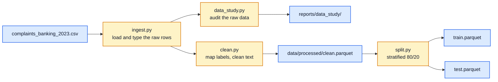

# Project rebuild

Ground-up rebuild of the classifier as separately runnable stages. Run these
commands from `project-rebuild` with the repository's dependencies installed:

```bash
python -m complaints.data_study   # audit the raw CSV
python -m complaints.clean        # apply labels and cleaning; write the training table
python -m complaints.split        # freeze the stratified train/test split
python -m pytest tests            # tests for the rebuild only
```

`complaints/config.py` loads the shared paths from `configs/runtime.yaml` and the
label mapping, dropped labels, and minimum word count from `configs/labels.yaml`.
The cleaning stage uses both configurations; ingestion and the data study use the
configured raw CSV path. YAML paths resolve relative to `project-rebuild`.
The default raw CSV remains in the parent repository; outputs go inside the rebuild.

All three runnable stages accept `--config path/to/runtime.yaml`. Explicit command-line
paths override the YAML settings:

```bash
python -m complaints.clean --config configs/runtime.yaml --out-path data/processed/clean.parquet
python -m complaints.data_study --config configs/runtime.yaml --out-dir reports/data_study
```

Cleaning also accepts `--data-path`, `--labels-config`, and `--reports-dir`.
The data study also accepts `--data-path`.

The data study writes `reports/data_study/audit.json` and `study.md`.
Cleaning writes `data/processed/clean.parquet` and `reports/cleaning/report.json`.
The split writes `data/processed/train.parquet`, `data/processed/test.parquet`, and
`reports/split/report.json` plus `assignment.csv`, the Complaint ID to split record.

## Data stages


