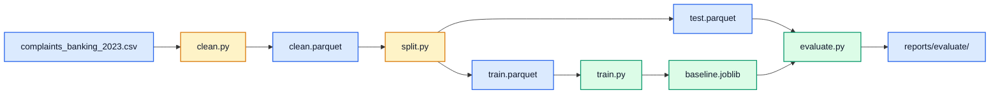

# Project rebuild

Ground-up rebuild of the classifier as separately runnable stages. Run these
commands from `project-rebuild` with the repository's dependencies installed:

```bash
uv run python -m complaints.data_study   # audit the raw CSV, optional
uv run python -m complaints.clean        # apply labels and cleaning; write clean.parquet
uv run python -m complaints.split        # freeze the stratified train/test split
uv run python -m complaints.train        # fit the baseline, save it, log to MLflow
uv run python -m complaints.evaluate     # score the saved model on the test set once
uv run python -m pytest tests            # tests for the rebuild only
```



## Configuration

`complaints/config.py` loads the shared paths from `configs/runtime.yaml` and the
label mapping, dropped labels, and minimum word count from `configs/labels.yaml`.
`complaints/vectorize.py` loads the modelling choices from `configs/baseline.yaml`.
YAML paths resolve relative to `project-rebuild`. The default raw CSV remains in the
parent repository; outputs go inside the rebuild.

Every runnable stage accepts `--config path/to/runtime.yaml`. Explicit command-line
paths override the YAML settings:

```bash
uv run python -m complaints.clean --config configs/runtime.yaml --out-path data/processed/clean.parquet
uv run python -m complaints.train --model-config configs/baseline.yaml --no-mlflow
uv run python -m complaints.evaluate --no-learning-curve
```

## What each stage reads and writes

| Stage | Reads | Writes |
| --- | --- | --- |
| `ingest.py` | The raw CSV | Nothing. `load_raw()` and `audit()` are used by data study and clean |
| `data_study.py` | Raw CSV | `reports/data_study/audit.json`, `study.md` |
| `clean.py` | Raw CSV, `labels.yaml` | `data/processed/clean.parquet`, `reports/cleaning/report.json` |
| `split.py` | `clean.parquet` | `train.parquet`, `test.parquet`, `reports/split/report.json`, `assignment.csv` |
| `train.py` | `train.parquet`, `baseline.yaml` | `models/baseline.joblib`, `reports/train/baseline.json`, an MLflow run in `mlruns/` |
| `evaluate.py` | `test.parquet`, `models/baseline.joblib` | `reports/evaluate/baseline.json`, `worst_mistakes.csv`, `figures/` |

The test set is read by `evaluate.py` only. Reports are committed; parquet files, the
model, and `mlruns/` are git-ignored and regenerate from the commands above.
